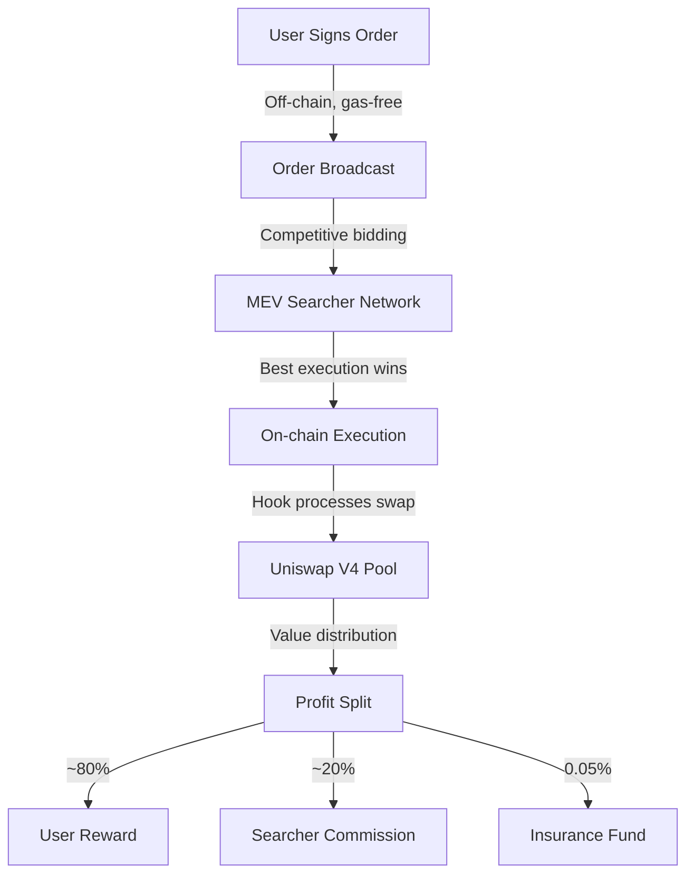

# DEX-Mini Gasless Swap Hook 🔄⚡

[](https://opensource.org/licenses/MIT)
[](https://getfoundry.sh/)
[](https://soliditylang.org/)

**Transform MEV into Shared Value** — A Uniswap V4 hook enabling zero-gas swaps with MEV profit sharing, creating a sustainable ecosystem for traders, LPs, and searchers.

## 🚀 Revolution in Trading

The Gasless Swap Hook reimagines Uniswap V4 trading through a competitive auction model:

| 🔥 Core Advantage | Description |
|-----------------|-------------|
| **Zero Gas** | Execute swaps without paying transaction fees |
| **Zero Slippage** | Trades executed precisely at target price |
| **MEV as Reward** | Competitive bidding redistributes value to traders |

## ⚡ How It Works



### The Process Flow

#### 1️⃣ User Order Submission
- Users sign orders with wallet (EIP-712)
- Zero gas cost for order creation
- Define swap parameters: tokens, amount, minimum output, deadline

#### 2️⃣ Competitive Auction
- Network of searchers monitors order broadcasts
- Searchers compete to offer best execution and highest rewards
- Competitive bidding generates surplus value for users

#### 3️⃣ Winning Execution
- Optimal searcher executes swap on-chain
- Hook validates integrity and processes transaction
- Value automatically distributed to user, searcher, and insurance fund

## 💎 Key Features

| Feature | How It Works | Benefit |
|---------|--------------|---------|
| **🛡️ Secure Trading** | EIP-712 signatures, nonce enforcement | Protection against front-running, replay attacks |
| **💰 MEV Recovery** | Competitive searcher bidding, tip forwarding | Users receive ETH tips + surplus value from swaps |
| **⚖️ Fair Execution** | BalanceDelta validation, price guardrails | Prevents manipulation, ensures fair execution |
| **🔒 Risk Management** | Insurance fee, circuit breakers, guardian system | Protocol-level protection against extreme events |

## 📊 Value Distribution Example

```
┌─────────────────────────────────────────────────────┐
│ Example Swap: 1 ETH → ~1850 USDC                    │
├─────────────────┬───────────────┬──────────────────┤
│                 │ Amount (USDC) │ Percentage       │
├─────────────────┼───────────────┼──────────────────┤
│ 🧑‍💻 User         │ 1812.075     │ 97.95% of output │
│ 🤖 MEV Reward    │ 37           │ 2% of output     │
│ 🏦 Insurance Fund│ 0.925        │ 0.05% of output  │
└─────────────────┴───────────────┴──────────────────┘
```

## 🛠️ Technical Components

### Core Contract Parameters

```solidity
// Key constant parameters
uint256 public constant MAX_MEV_REWARD_BPS = 1000; // 10%
uint256 public constant INSURANCE_FEE_BPS = 5;     // 0.05%
uint256 private constant TIMELOCK_DELAY = 2 days;  // Governance delay

// Order structure for gasless swaps
struct Order {
    address trader;
    PoolKey poolKey;
    address tokenIn;
    address tokenOut;
    uint256 amount;
    uint256 minAmountOut;
    uint256 deadline;
    uint256 nonce;
    bool exactInput;
    bytes orderSignature;
    bytes permitSignature;
}
```

### Security Measures

- **Multi-Layer Protection:**
  - Reentrancy Guards
  - Signature Validation
  - Emergency Pause System
  - Parameter Updates with 48-hour Timelock

```solidity
// Security snippets
modifier nonReentrant() {
    require(_status != _ENTERED, "Reentrancy");
    _status = _ENTERED;
    _;
    _status = _NOT_ENTERED;
}

// Emergency Stop
function emergencyPause(bool pause) external {
    require(guardians[msg.sender] || msg.sender == owner, "Unauthorized");
    systemPaused = pause;
}
```

## 👩‍💻 User Journeys

### Alice's Trading Experience

- Signs with wallet (0 gas)
- Order broadcasted to searcher network
- Receives more output than requested due to competitive auction
- Automatically gets ETH tips from searchers

### Bob's LP Experience

| Metric | Hook Pool 🪝 | Regular Pool 🌀 | Advantage 📈 |
|--------|-------------|-----------------|--------------|
| Daily Volume | $5.2M | $3.8M | +36.8% |
| MEV Protection | Level 3 | Level 1 | -62% loss |
| Fee Efficiency | 22% | 18% | +4% |

## 🔧 Getting Started

### Requirements
- Foundry 0.8.20+
- Node.js 18.x
- Uniswap V4 Environment

### Installation
```bash
git clone https://github.com/DexMini/Dex-Mini-Gasless-Hook
cd Dex-Mini-Gasless-Hook
forge install
forge build
```

### Test Flow
```bash
# Run all tests
forge test

# Run specific test groups
forge test --match-contract GaslessSwapHookTest
forge test --match-test test_gaslessSwapExecution

# Check gas metrics
forge test --gas-report
```

## 🏛️ Governance & Security

### Parameter Management
- MEV reward rates can be tuned (capped at 10%)
- All parameter changes subject to 48-hour timelock
- Emergency circuit breakers managed by multi-sig guardians

### Audit Status
- Comprehensive test suite covering edge cases
- Developer audit completed
- Professional audit scheduled for Q2 2023

---

<div align="center">
    <h3>Transform DeFi trading where users, LPs, and searchers all win together 🚀</h3>
</div>